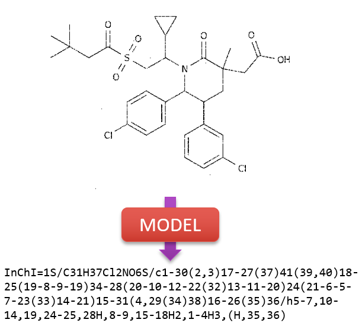

# img2inchi

本项目可以将分子骨架式转换为InChI表达式。



## 配置文件
将config_templates文件夹复制一份为config文件夹，所有的配置将默认从这个文件夹读取。
具体的配置稍后说明。

## 安装依赖

## 准备训练数据

### 数据下载
在Kaggle上直接下载数据到/data下，解压到data/origin(推荐)。
https://www.kaggle.com/c/bms-molecular-translation

确认解压后的数据文件夹(data/origin)：
* test/
* train/
* extra_approved_InChIs.csv
* train_labels.csv


### 数据预处理
这部分的详细说明参考data/README.md
#### 配置参数
根据生成数据集大小，我们有两个预置的模板：
* data_prepare_small.yaml: 小数据集
* data_prepare.yaml: 全数据集

可以根据自己的需求直接调用或者在此基础上修改配置。
具体的配置含义请参考data/README.md

#### 预处理
在项目根目录下运行：
```bash
python prepare.py --root <project_root> --pre_config <prepare_config>
# --root 项目的根目录，默认为 "./"
# --vocab_config 词表配置文件目录（根目录的相对路径），默认为 "./config/vocab.yaml"
```

#### 配置数据集配置文件
根据生成数据集大小，我们有两个预置的模板：
* data_small.yaml: 小数据集
* data.yaml: 全数据集

可以根据自己的需求直接调用或者在此基础上修改配置。  
配置文件中各项配置作用如下表：

| 名称                      | 作用                                       | 示例                           |
| ------------------------- | ----------------------------------------- | ------------------------------ |
| `path_train_root`         | 训练集根目录。                              | `'./'`                         |
| `path_train_data_dir`     | 训练集目录，相对根目录的相对路径。           | `'data/prcd_data_small/'`      |
| `path_train_img_dir`      | 训练集数据文件夹，相对训练集目录的相对路径。  | `'train'`                      |
| `train_annotations_file`  | 训练集数据索引文件，相对训练集目录的相对路径。| `'small_train_set_labels.csv'` |
| `path_val_root`           | 验证集根目录。                              | `'./'`                         |
| `path_val_data_dir`       | 验证集目录，相对根目录的相对路径。           | `'data/prcd_data_small/'`      |
| `path_val_img_dir`        | 验证集数据文件夹，相对验证集目录的相对路径。  | `'validate'`                   |
| `val_annotations_file`    | 验证集数据索引文件，相对验证集目录的相对路径。| `'small_val_set_labels.csv'`   |
| `dataloader_num_workers`  | DataLoader加载数据时的进程数目。             | `2`                           |

## 训练

### transformer
#### 配置模型参数
预置模板为transformer_config.yaml  
可以根据自己的需求直接调用或者在此基础上修改配置。  
配置文件中各项配置作用如下表：

| 名称                            | 作用                                         | 示例                           |
| ------------------------------- | ------------------------------------------   | ------------------------------ |
| `transformer.feature_size_1`    | 输出的特征图高度，为空则表示用默认尺寸，整数型|None         | `None`                         |
| `transformer.feature_size_2`    | 输出的特征图宽度，为空则表示用默认尺寸，整数型|None         | `None`                         |
| `transformer.extractor_name`    | 特征提取器的名称，`'resnet34'`或`'resnet101'`，字符串      | `'resnet34'`                     |
| `transformer.pretrain`          | 预训练特征提取器的路径，`''`表示读取默认的预训练模型，`'none'`表示随机初始化参数| `'./model_weights/pretrained_resnet34.pth'`|
| `transformer.tr_extractor`      | 是否训练特征提取器，布尔型                                 | `FALSE`                        |
| `transformer.num_encoder_layers`| Encoder层数，整数型                                       | `10`                           |
| `transformer.num_decoder_layers`| Decoder层数，整数型                                       | `20`                           |
| `transformer.d_model`           | 模型维数或宽度，整数型                                     | `512`                          |
| `transformer.nhead`             | Attention中的头数，整数型                                 | `8`                            |
| `transformer.dim_feedforward`   | 逐点前馈的中间层维数，整数型                               | `1024`                         |
| `transformer.dropout`           | Drop out概率，浮点型                                      | `0.1`                          |

#### 正式训练
在项目根目录下运行：
```bash
python train.py --model_name transformer --instance <instance_name> --data ./config/data_small.yaml
# --vocab 词表配置文件路径，默认为 "./config/vocab.yaml"
# --model 模型配置文件路径，默认为 ""，表示根据模型名称从./config/中找
# --scst  是否进行SCST训练，默认为 False
# --output 模型输出与保存的根目录，默认为 "./model_weights"。模型输出及ckpt将保存至<output>/<instance>下
```

### seq2seq
未维护，可能无法运行
### 使用SCST
未维护，可能无法运行
## GUI

## 参考文献